# Top 12 Best Lifetime Software Deal Platforms in 2025

Subscription fatigue is real—paying monthly fees for every business tool adds up fast, bleeding your budget dry before you know it. Lifetime software deals flip that model upside down, letting you pay once and own tools forever, saving thousands annually while building your tech stack without recurring nightmares. The catch? Finding legitimate platforms that actually deliver quality software at sustainable discounts, not just digital snake oil dressed up as deals.

This guide walks through the most trusted lifetime deal marketplaces where entrepreneurs, freelancers, and small businesses discover software that would normally cost hundreds monthly for a fraction of the price. From marketing automation to productivity tools, these platforms have helped thousands eliminate subscription costs while accessing the same powerful software larger companies use.

## **[AppSumo](https://appsumo.com)**

The OG lifetime deal marketplace connecting entrepreneurs with software they actually need, not just want.

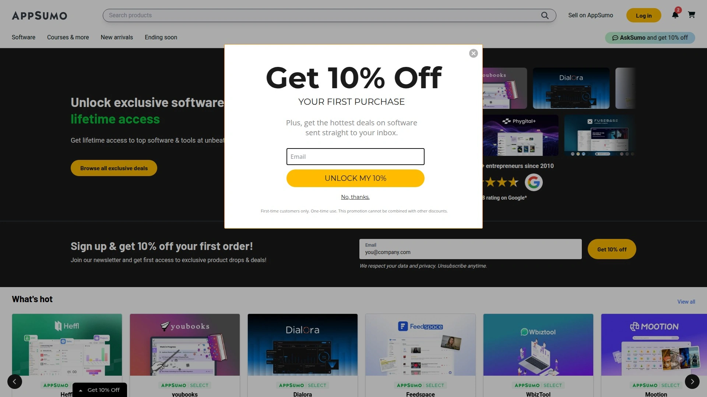

AppSumo pioneered the lifetime software deal space and remains the gold standard after years of curating tools specifically for bootstrapped businesses and solopreneurs. Their platform showcases hundreds of software products across categories like marketing, productivity, design, development, and ecommerce—each vetted to ensure legitimate value rather than vaporware.

The deals themselves range from $19 to $300+ depending on tier levels, but all eliminate recurring billing forever. You'll find AI tools like Nexuscale for B2B lead generation, productivity platforms like FuseBase with AI-powered workspaces, and course builders like TagMango for monetizing expertise—each offering lifetime access at 80-95% off typical subscription costs.

**What makes AppSumo different:** Their Plus membership ($99 annually) unlocks extended 10% discounts, exclusive early access to new deals, and additional perks that compound savings across multiple purchases. Every deal includes a 60-day money-back guarantee, giving you actual time to test whether the tool fits your workflow before committing.

The platform segments deals by user type—SaaS founders, developers, marketers—making it dead simple to find relevant tools without wading through irrelevant noise. Popular categories include email marketing tools like ZeroBounce for validation, web builders like Grigora with drag-and-drop functionality, and project management solutions that streamline team collaboration.

Reviews from actual buyers appear on every deal page, showing real usage patterns and honest feedback that cuts through marketing fluff. AppSumo's community aspect means you're not just buying software—you're tapping into thousands of entrepreneurs sharing tips, use cases, and creative implementations you wouldn't discover solo.

## **[StackSocial](https://www.stacksocial.com)**

Tech deals marketplace serving everything from lifetime software subscriptions to hardware gadgets and online courses.

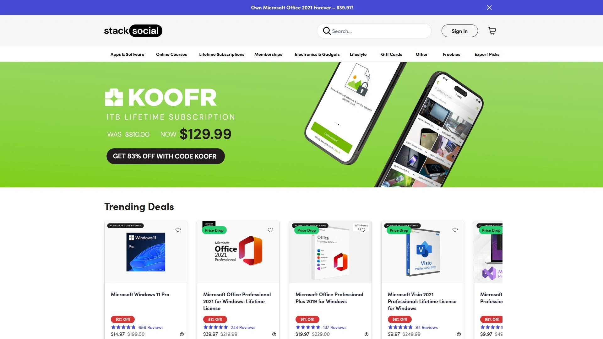

StackSocial casts a wider net than pure software platforms, featuring lifetime deals on apps, learning bundles, VPN services, and even physical tech products alongside digital tools. Their software section rivals specialized platforms, offering Microsoft Office lifetime licenses, Adobe alternatives, productivity suites, and specialized tools at discounts reaching 90% off retail.

**The platform excels at bundled deals**—think Microsoft Office Pro plus project management courses, or antivirus software stacked with cloud storage, creating comprehensive packages that deliver more value than individual purchases. You'll regularly find Windows 11 Pro licenses for under $20, NordVPN lifetime subscriptions at 81% off, and professional software suites that would normally require expensive monthly commitments.

Learning resources get equal attention, with Babbel language learning lifetime access, Skoove piano lessons, and tech skill courses bundled with relevant software tools. Their AI-powered tool collections include multiple models and editing capabilities in single lifetime packages, perfect for content creators needing diverse functionality without juggling subscriptions.

StackSocial runs frequent sales events like Deal Days where discounts climb even higher, plus they offer Pay What You Want bundles that let customers name their price for software collections. The breadth means you're shopping one destination for both business tools and personal tech needs rather than hopping between specialized platforms.

## **[PitchGround](https://pitchground.com)**

Quality-focused lifetime deal platform emphasizing emerging SaaS tools before they hit mainstream pricing.

PitchGround carved its niche by featuring newer, innovative software products alongside established tools, giving early adopters access to cutting-edge solutions at founding member pricing. The platform partners with software developers launching or scaling products, offering lifetime deals that benefit both sides—users get incredible discounts, developers get crucial early customers and feedback.

Deal selection spans marketing automation, productivity apps, design tools, development resources, and business management software, with most offerings priced between $49-$199 for lifetime access. Recent highlights include WebinarKit for hosting webinars, EasySendy for email campaigns, and Nector for customer engagement—each representing modern solutions to common business challenges.

**The platform prioritizes sustainability**—deals run longer than typical 7-day flash sales, giving you breathing room to research, test, and decide without artificial urgency pushing premature purchases. Their curation process filters out low-quality tools, focusing on software with genuine utility and development roadmaps that suggest long-term viability.

PitchGround maintains an active community where users share experiences, implementation tips, and creative use cases for featured tools, creating knowledge exchange that amplifies the value beyond just software access. The platform undergoes periodic refreshes to ensure deal quality remains high and inventory stays relevant to evolving business needs.

## **[Dealify](https://dealify.com)**

Curated marketplace emphasizing premium SaaS tools with a personalized selection approach over quantity flooding.

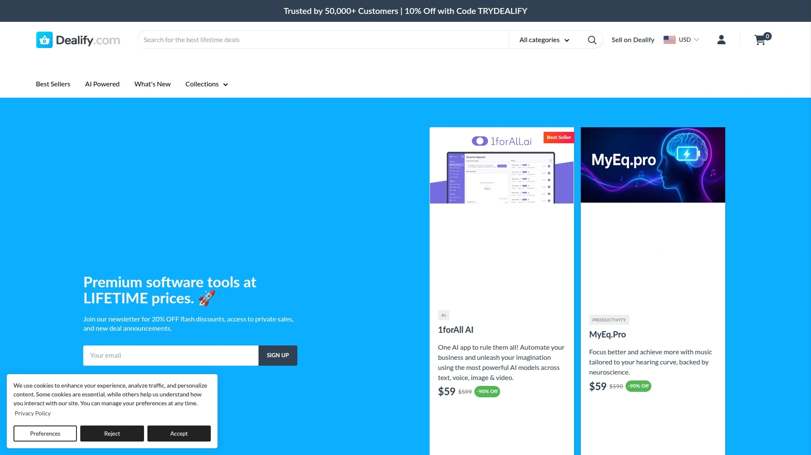

Dealify operates on the philosophy that fewer, better deals serve customers more effectively than overwhelming catalogs of mediocre software. Their smaller, hand-picked selection prioritizes genuinely valuable, well-developed products over churning through countless forgettable tools just to maintain inventory volume.

**The curation shows in quality**—Dealify partners with software companies building serious solutions rather than minimum viable products thrown together hoping for quick cash. You'll find sophisticated marketing automation platforms, robust content marketing tools, comprehensive SEO suites, and collaboration software that rivals enterprise options at fraction-of-the-cost lifetime pricing.

Deals typically run longer timeframes than competitors, removing pressure to purchase within 48 hours and allowing thorough evaluation of whether tools genuinely fit your workflows. Their Dealify Select membership ($49 annually) provides exclusive additional discounts plus early access to new deals before general availability.

The platform targets emerging tools that may not yet have mass market recognition but offer innovative approaches to common problems—think next-generation alternatives to established software categories rather than just cheaper clones. Customer support earns consistent praise for responsiveness and actually helping users maximize tool value post-purchase rather than disappearing after checkout.

## **[DealMirror](https://dealmirror.com)**

Comprehensive lifetime deal hub offering software across all business categories with transparent community engagement.

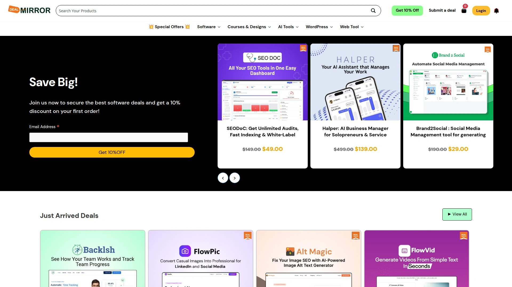

DealMirror positions itself as a trusted destination for entrepreneurs and marketers seeking legitimate lifetime software deals without wading through questionable vendors. Their catalog spans marketing tools, productivity applications, website builders, design software, and business management platforms—basically covering every software category small businesses actually use.

**The platform emphasizes transparency** with active community groups where users discuss tools, share implementation strategies, and provide honest feedback on purchases. This community-first approach creates accountability and helps surface both strengths and limitations of featured software before you commit money.

VIP membership ($119 one-time) provides 5% automatic discounts on all future purchases plus exclusive access to periodic free deals, making the membership cost back quickly for active buyers building comprehensive tool stacks. The lifetime membership structure itself mirrors their software philosophy—pay once, benefit forever.

DealMirror curates deals from multiple sources while maintaining quality standards, functioning as both direct vendor and aggregator that surfaces the best options regardless of origin. Their deal pages include detailed information, user reviews, and realistic use case descriptions that help evaluate fit rather than just selling features.

## **[SaaSMantra](https://saasmantra.io)**

Community-driven SaaS marketplace bridging software founders and target users through mutual value exchange.

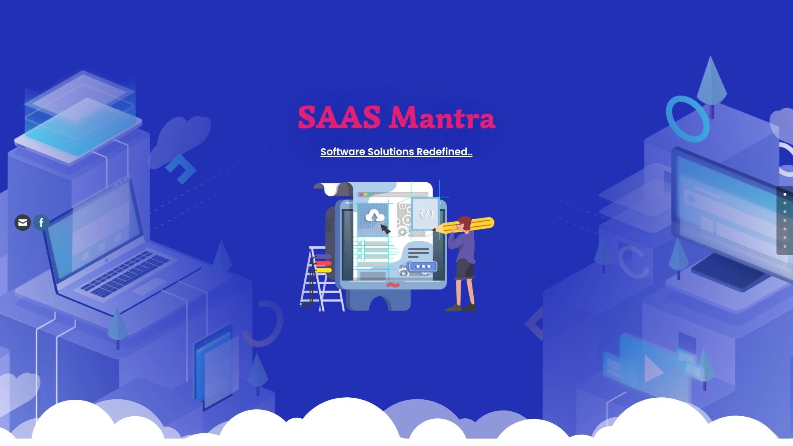

SaaSMantra operates differently than pure deal sites—they position as a community-first marketplace where founders and users connect for mutually beneficial relationships rather than just transactional purchases. Founded in 2016, the platform has facilitated over $7 million in revenue for software partners while serving 58,000+ businesses across 49 countries.

**Their "Growing Together" philosophy** means featured software gets carefully vetted to ensure genuine utility and development commitment rather than abandoned projects that strand lifetime deal buyers. The platform emphasizes quality over quantity, working with 200+ SaaS products that demonstrate long-term viability and ongoing improvement.

Deal selection focuses on tools that solve real growth challenges for businesses—lead generation, web development, marketing automation, productivity enhancement, and client management. Each featured tool gets thorough presentation explaining use cases, target customers, and integration possibilities so buyers understand exact fit before purchasing.

The community aspect creates ongoing value through discussion forums, product spotlights, and validation from real users implementing tools in their businesses. SaaSMantra targets the intersection of spectacular software developers and users who need their solutions, creating marketplace efficiency that benefits both sides.

## **[RocketHub](https://www.rockethub.com)**

Entrepreneur-focused lifetime deal platform featuring exclusive software and content at no-brainer pricing.

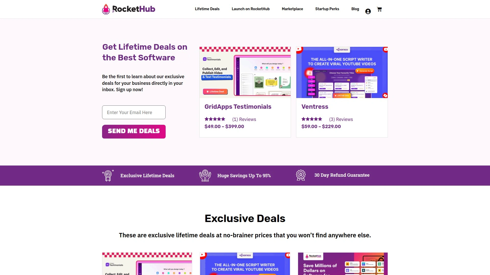

RocketHub positions itself as a source for amazing software deals curated specifically for entrepreneurs, by entrepreneurs who understand bootstrapped business realities. Their emphasis on exclusivity means many featured deals can't be found elsewhere at equivalent pricing, creating unique opportunities for early tool adoption.

**Quality and sustainability drive curation**—RocketHub aims to feature tools that will actually survive and thrive long-term rather than flash-in-the-pan products that disappear six months post-launch. This curation protects lifetime deal buyers from the worst-case scenario: paying for "lifetime" access to software that ceases existing.

The platform includes both software tools and information products, recognizing that entrepreneurs need education and implementation resources alongside technical solutions. Deal pages feature detailed Q&A sections where creators directly answer prospective buyers' questions about use cases, integrations, and roadmap plans.

Extra discount codes occasionally appear for new launches or expiring deals, with patterns like "TOOLNAME-EXTRA-10" providing additional 10% savings on top of already discounted lifetime pricing. RocketHub's startup perks program extends value beyond individual deals, offering 250+ perks representing $3M+ in combined savings across tools, services, and resources.

## **[SaaSPirate](https://saaspirate.com)**

Comprehensive aggregator collecting 576+ lifetime deals from multiple platforms with exclusive discounts and coupons.

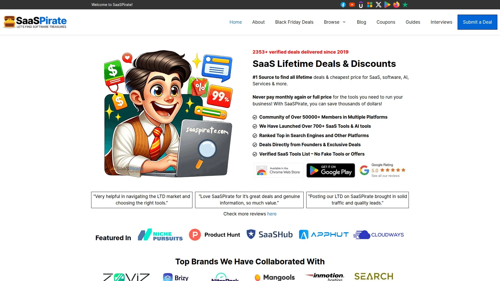

SaaSPirate functions as a meta-platform, curating and aggregating lifetime deals from AppSumo, PitchGround, RocketHub, and other sources into one searchable destination. Their catalog spans business software, CRM tools, email marketing, legal tech, payment systems, scheduling apps, content creation, SEO tools, and dozens more categories.

**The aggregation advantage** means you're not manually checking five different platforms hoping to spot relevant deals—SaaSPirate does that work, presenting curated selections with discount percentages, platform sources, and direct links to active offers. Deals include tools like Venturz for startup management, WriterZen for SEO content creation, and GuidedTrack for no-code app building, each showing original pricing versus discounted lifetime cost.

Exclusive coupon codes appear alongside deals, providing additional savings beyond standard platform pricing and maximizing value for every purchase. The site categorizes deals by function, making it simple to find marketing tools, development resources, or business management software without scrolling endless uncategorized lists.

Deal pages include AI indicators showing which tools leverage artificial intelligence, helping users identify modern solutions incorporating latest technologies. The platform maintains freshness by continuously updating with new deals as they launch across partner platforms, ensuring you're seeing current opportunities rather than expired offers.

## **[GrabLTD](https://www.grabltd.com)**

Lifetime deal platform emphasizing huge savings on SaaS tools with educational resources explaining deal mechanics.

GrabLTD targets entrepreneurs who generally can't afford thousands monthly for comprehensive tech stacks, offering lifetime deals as novice-friendly entry points to premium software. Their platform recognizes that subscription costs ranging from $10-$1,000 monthly per tool create unsustainable financial burdens for bootstrapped businesses.

**Educational content accompanies deals**—GrabLTD explains how lifetime deal models work, why vendors offer them, and how buyers can maximize value while avoiding common pitfalls. This educational approach helps first-time lifetime deal buyers understand mechanics, benefits, and considerations beyond just "cheap software."

The platform aggregates deals from PitchGround, DealMirror, and other sources while adding their own curation layer and sometimes negotiating exclusive pricing or extended access windows. Categories span every business need from marketing and sales tools to development resources and productivity applications.

GrabLTD emphasizes the financial transformation lifetime deals enable—eliminating recurring billing obligations, reducing bookkeeping complexity, and providing immediate access to tools that would otherwise require substantial monthly commitments before seeing ROI. Their deal pages highlight potential monthly cost equivalents, making savings concrete and quantifiable rather than abstract percentages.

## **[Mighty Deals](https://www.mightydeals.com)**

Digital marketplace focusing on creative assets and design tools alongside software lifetime deals for visual professionals.

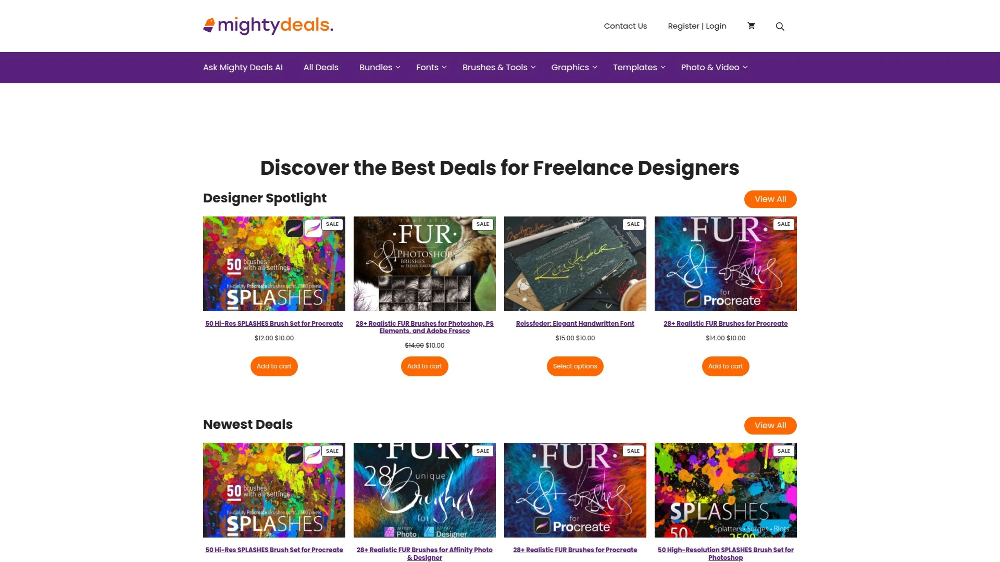

Mighty Deals carved its niche serving graphic designers, digital marketers, and creative professionals with both software tools and design asset bundles. The 15+ year platform history demonstrates sustainability and trustworthiness—they've navigated industry changes while maintaining quality standards and customer satisfaction.

**Creative focus differentiates content**—alongside typical business software, Mighty Deals features design templates, font collections, graphic bundles, and visual assets that complement software tools. This combination serves creative professionals needing both the programs and the resources to produce client work efficiently.

Software deals emphasize tools relevant to creative workflows—image editors, video production software, website builders with visual emphasis, and marketing platforms that require design integration. The platform negotiates directly with vendors to secure best possible pricing rather than just listing third-party offers.

The site maintains straightforward access without mandatory memberships or paywalled content—deals sit just clicks away from browsing to purchase. Their 30-day return policy provides security for testing software fit without getting locked into unsuitable purchases. Customer support and community engagement earned Mighty Deals acquisition by Onfolio in 2021, validating their business model and customer value proposition.

## **[Snap Up LTD](https://snapupltd.com)**

SaaS deal aggregator publishing active lifetime offers from top platforms in centralized, searchable interface.

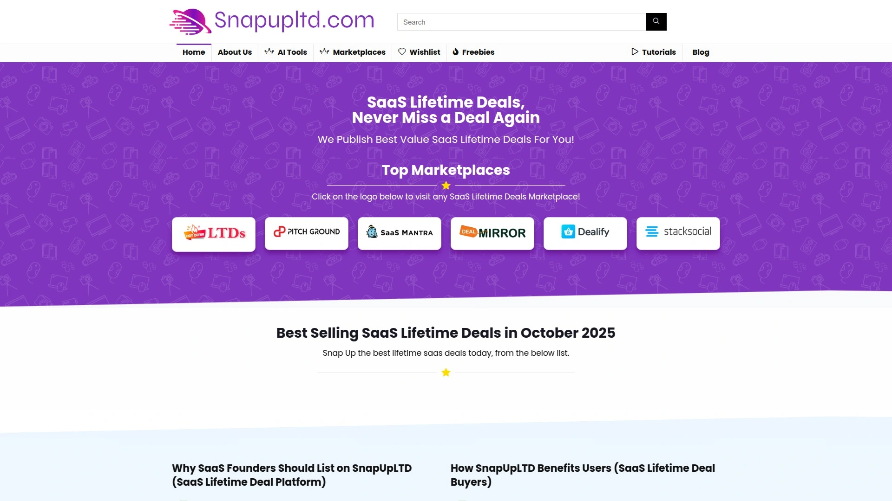

Snap Up LTD functions as a deals portal collecting and presenting lifetime software offers from Dealify, DealMirror, PitchGround, SaaSMantra, StackSocial, and other leading platforms. Their value proposition is simple—never miss deals by checking one destination instead of monitoring five separate sites daily.

**The aggregation eliminates FOMO**—you're not wondering whether better deals exist elsewhere or missing time-sensitive offers because you didn't check the right platform that day. Snap Up LTD maintains freshness by continuously updating with new deals as they launch, ensuring current opportunities appear quickly.

Deal presentation includes platform source, discount percentage, original pricing versus lifetime cost, and direct links to purchase on the originating site. Categories span all business needs with organized browsing by function—marketing tools, development resources, productivity apps, content creation, and more.

The platform emphasizes the fundamental lifetime deal value proposition: save money on useful software, grow your online presence, eliminate monthly fees forever with one-time payments. Their searchable interface and filtering options help find specific tool types or price ranges without manually scrolling hundreds of unrelated offers.

## **[Lifetimo](https://lifetimo.com)**

Lifetime deal discovery platform aggregating offers across multiple marketplaces with community discussion and giveaways.

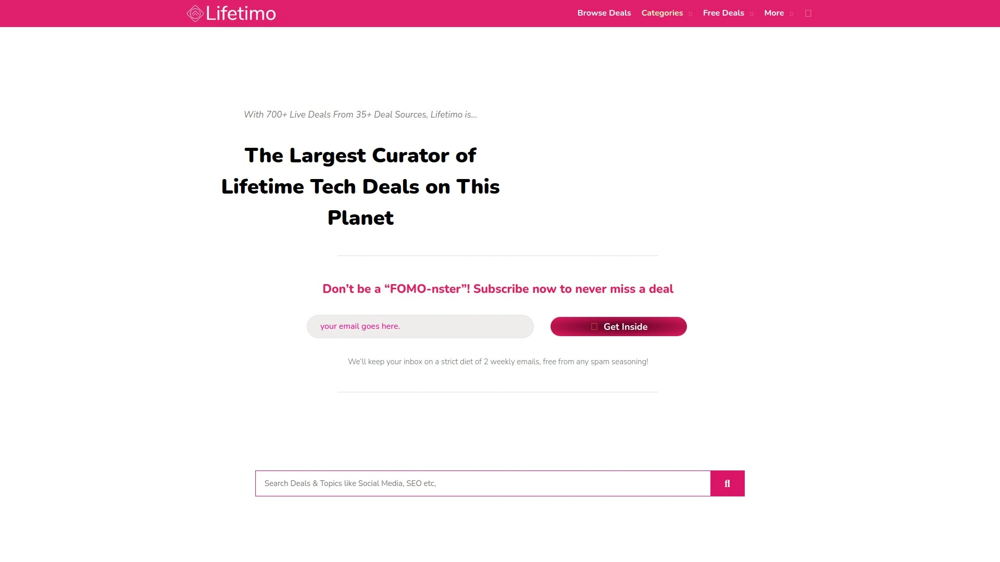

Lifetimo operates as both deal aggregator and community hub, collecting lifetime software offers while fostering discussions where users share experiences, strategies, and implementation tips. Their platform coverage includes AppSumo, PitchGround, RocketHub, DealMirror, and other major sources, presenting unified view of available opportunities.

**Community features differentiate the experience**—group discussions let members share deal evaluations, participate in threads about specific tools, and win software through periodic giveaways. This social layer adds context and real-world feedback that pure deal listings lack.

Deal pages include comprehensive information about included features, access terms, pricing tiers, and refund policies so buyers understand exact purchase terms before committing. The platform maintains separate sections for deals by source marketplace, letting users browse PitchGround-specific offers or DealMirror exclusives when preferring particular vendor relationships.

Lifetimo emphasizes education around making smart lifetime deal purchases—understanding redemption processes, recognizing quality indicators, evaluating long-term tool viability, and avoiding common buyer mistakes. Their goal extends beyond just facilitating transactions to building informed community that maximizes value from lifetime deal ecosystems.

## **[Best Lifetime Deals](https://bestlifetimedeals.com)**

Curated collection organizing software lifetime deals by platform, category, and vendor with filtering for efficient discovery.

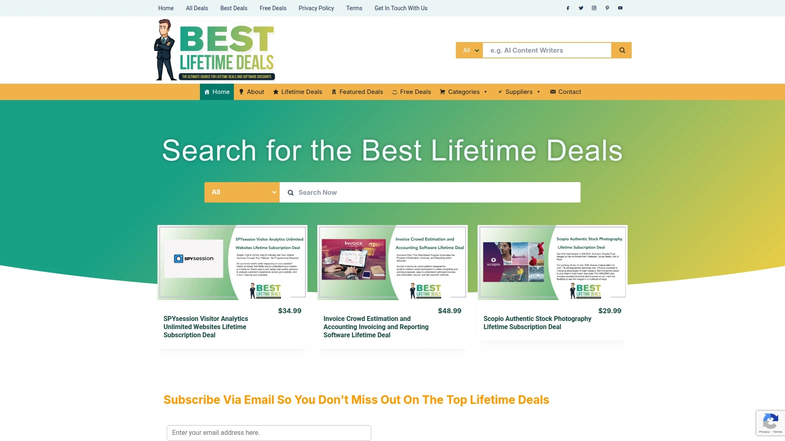

Best Lifetime Deals aggregates offers from AppSumo, PitchGround, DealMirror, Dealify, and other sources while adding organizational layers that simplify finding relevant tools. Their categorization by both platform and software function lets users browse in whichever way matches their shopping mental model.

**Curation focuses on legitimacy**—the platform features software with proven track records and developer commitment rather than every available deal regardless of quality. This filtering protects buyers from wasting money on abandoned projects or tools that sound good but deliver poorly.

Platform-specific sections let users explore PitchGround's current offerings, DealMirror's latest additions, or Dealify's curated selection without navigating to each individual site. This consolidated browsing saves time while ensuring you're seeing the full landscape of available deals across all major sources.

Deal descriptions emphasize practical applications and target user profiles—who should buy this, what problems it solves, which workflows it enhances—rather than just listing features. The goal is helping buyers quickly evaluate fit and make informed decisions rather than impulse purchases based on discounts alone.

***

## FAQ

**How do lifetime software deals actually work without monthly fees?**

Lifetime deals let you pay one flat fee for permanent software access instead of recurring subscriptions, typically costing 80-95% less than cumulative monthly payments over time. Vendors offer these during launch phases to build user bases, generate cash flow for development, and gather feedback for improvements, creating win-win scenarios where customers get incredible value and developers get crucial early adoption. The tools remain yours forever regardless of future price increases, though some deals include specific feature tiers or usage limits defined at purchase.

**Are lifetime deals risky since software companies might disappear?**

Quality platforms like AppSumo and PitchGround vet vendors for sustainability indicators—active development roadmaps, funding status, existing user bases, and committed teams—reducing but not eliminating shutdown risks. Most reputable lifetime deal platforms offer 60-day money-back guarantees letting you test tools thoroughly before committing, plus they maintain standards requiring vendors to honor lifetime terms or face platform consequences. Focus on established platforms with track records rather than unknown sites offering deals that seem too good to be true, and diversify your tool stack rather than betting your entire business on one lifetime deal product.

**Can I actually build a complete business tech stack using lifetime deals?**

Absolutely—thousands of entrepreneurs run entire businesses on tools acquired through lifetime deals across categories including email marketing, CRM, project management, website building, SEO, content creation, and customer support. The key is strategic purchasing based on actual needs rather than impulsively buying every cheap deal, ensuring tools integrate properly and serve real workflow requirements. Start with core business functions you're currently paying monthly for, replace those with lifetime deal alternatives, then expand into nice-to-have tools that enhance productivity once essentials are covered.

***

## Build Your Stack Without Breaking Your Budget

Subscription software doesn't have to drain thousands monthly from your business—lifetime deal platforms offer legitimate alternatives that eliminate recurring costs while delivering professional-grade tools. These twelve marketplaces represent the most reliable sources for discovering software that solves real business problems at prices that make sense for bootstrapped entrepreneurs and growing companies.

[AppSumo](https://appsumo.com) stands out as the ideal starting point because their 60-day guarantee, extensive deal variety across all business categories, and decade-plus track record provide security and selection that newcomers to lifetime deals need. Their vetting process, active community, and customer-focused policies make them the safest bet for building your initial lifetime deal tool stack.

Start with [AppSumo](https://appsumo.com) to replace your most expensive monthly subscriptions with lifetime alternatives, then explore specialized platforms when specific needs arise that require deeper tool catalogs or niche software categories.
